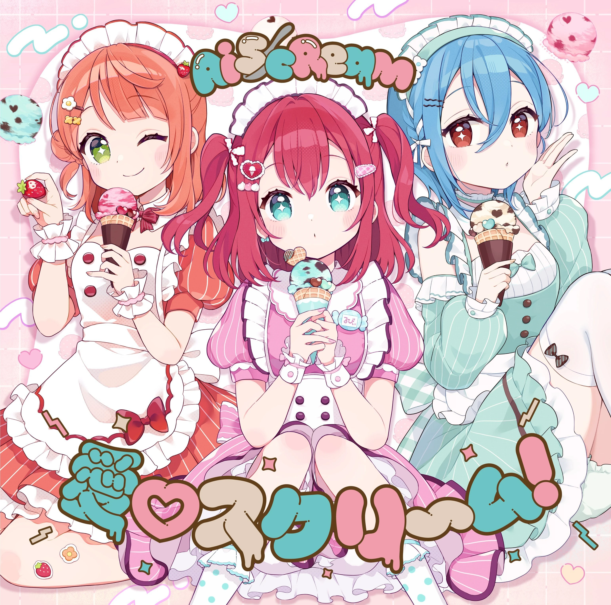

# nani ga suki?




## about

This is a program written in Ruby (intentionally).


Ask the characters or everyone what do they like. Works with both English and Romaji.

## how to run

Main program is "kurosawa.rb". There are two ways to run the program.

### Prerequisite: installing ruby

please refer to the [ruby documentation](https://www.ruby-lang.org/en/documentation/installation/)

e.g. for Debian `sudo apt install ruby-full`

### Option 1: using ruby interpreter

```
ruby kurosawa.rb
```

### Option 2: run as executable

```
sudo chmod +x kurosawa.rb  # only needed for first time
./kurosawa.rb
```
